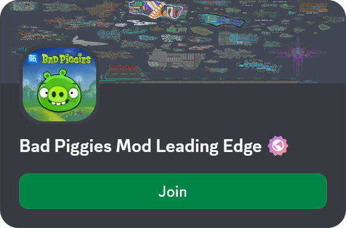
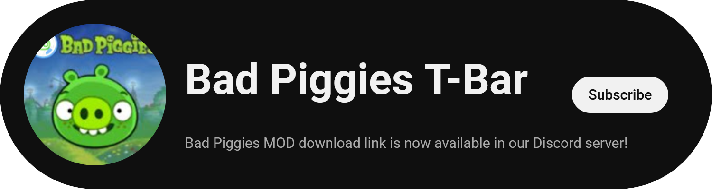
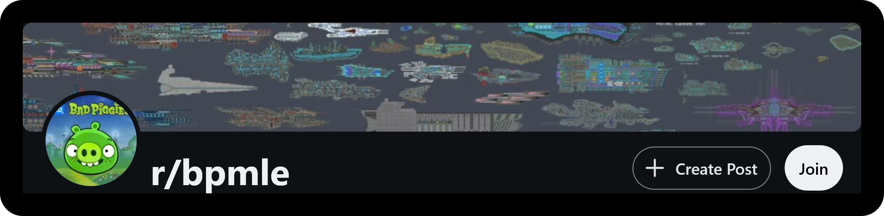

# BPLE Decompilation

This repository contains a decompiled source code of BPLE by Miuna.

This repository has been deviated slightly, it also contains several bug fixes and improvements without introducing new features. For more-or-less source code of the original BPLE, check out the first commit.

## 2022.1.9

The base of this repository has been started off with BPLE 2022.1.9, which is a beta version (so called "Technology Version"). For the previous release, check out my [BPLE 2022.1 Decompilation repository](https://github.com/anstropleuton/BPLE).

This repository maintains changes made to that repository, as well as other changes specific to the Technology Version.

## Credits

- [Miuna](https://github.com/miu-na) for all the prior modding effort on Bad Piggies.
- [AssetRipper](https://github.com/AssetRipper/AssetRipper) for Unity project decompilation.
- [RenderDoc](https://renderdoc.org) for raw shader decompilation.
- [ChatGPT](https://chatgpt.com) for manual shader reverse engineering.
- [Bayu Satiyo](https://github.com/kiraio-moe/remove-unity-splash-screen) for splash screen removal tips.
- [Rovio](https://www.rovio.com) for creating the base game Bad Piggies.

## How To Build

- Install [Unity 2021.3.45f2](https://unity.com/releases/editor/whats-new/2021.3.45f2)
  - Supported build platforms:
    - Windows (x32 and x64)
    - Linux (x64)
    - Android (ARM32 and ARM64)
- Clone this repository `git clone --depth=1 https://github.com/anstropleuton/BPLE-2022.1.9.git`
- Open the project from Unity
- Build AssetBundles using my custom editor script menu BPLE > Bundle > All (or for the current build target such as Android)
- Build with my custom editor script menu BPLE > Build > All (or for the current build target such as Android) \* \*\*
- Enjoy :)))

\*: If you want to build directly, you don't need to manually build the bundle.

\*\*: You need the appropriate build support module for Unity for the target build platform.

## Pre-built Releases

### WARNING!!!

The builds of BPLE are ONLY officially released through Discord (and maybe, in the future, through Reddit). If you find BPLE outside of the Discord server (e.g., Itch.io), BEWARE! It might contain virus, malware, spyware, infostealer, adware or other bad stuff.

It's best that you check for viruses before installing, including this one (just so you get a habit of it)!

Restrictions for distributing outside of our Discord server has been lifted, however, Discord server remains the ONLY trustred source for official and verified releases.

If you want to release your own custom mod, please reach out to one of the moderator of our Discord server so we provide downloads to your mod from our Downloads channel. You are not obligated to release through our channel though. Thanks!

## Open Source?

This is NOT "open source" in any traditional sense. No authors involved has granted rights to copy, modify or distribute. Use at your own risk.

## Legal Notice

This project is NOT affiliated with Rovio in any way. This decompilation and BPLE exists to extend the base game Bad Piggies and to keep it alive. We are releasing the decompilation source code of BPLE publicly in hopes of keeping the Bad Piggies community alive.

Please, feel free to fork this project and make your own modifications on top of it!

## Socials

Let us know what you did with the decompilation in our Discord server!

Subscribe to our YouTube channel for great BPLE videos!

Check out our Reddit subreddit for creations!

## Tutorials

New video tutorials coming soon...
